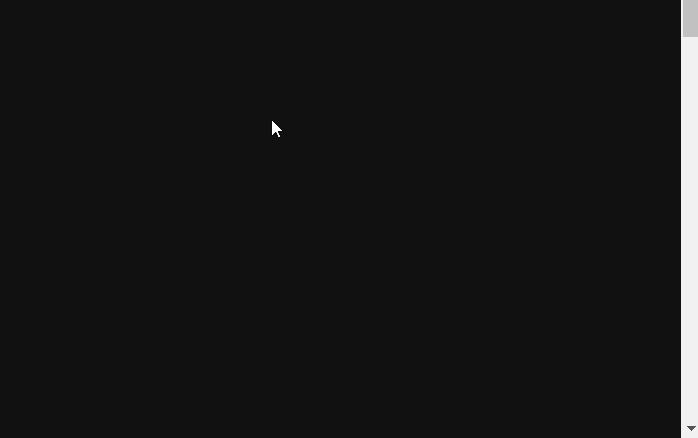
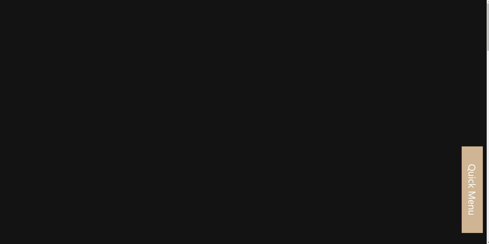
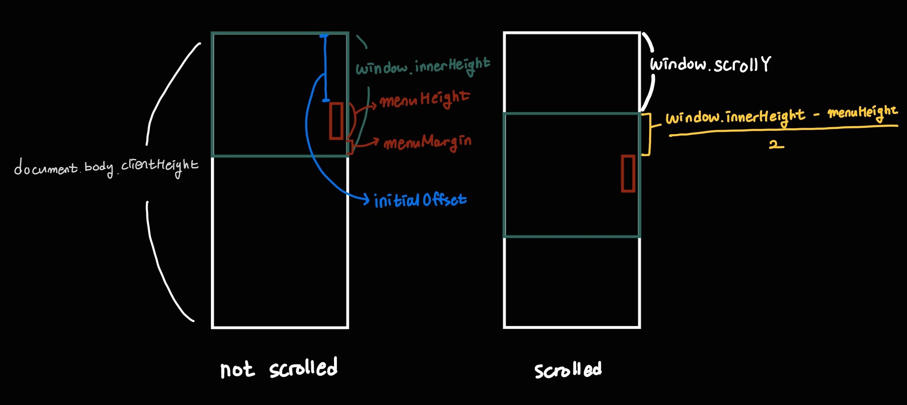

- [English](#react-scroll-event)

# React scroll event

## Overview

When you surf the Internet, you can easily find some website that react to mouse scroll events. In this project, I practiced react by creating webpage that changes in response to user scroll.

Following are features this webpage has.

1. [A Scroll-to-Top button](#scroll-to-top-button)
2. [A quick menu button which follows the user](#quick-menu-button)
3. [A navigation bar that knows which content is currently displaying](#navigation-bar)
4. [A scroll progress bar](#scroll-progress-bar)

## ✨Scroll-to-Top Button

<div align="center">

</div>

- I added an onClick event handler to the button component, and used a **window.scrollTo** function to scroll to the top of the page when clicking this button. In the scrollTo funtion, we can use a **behavior parameter** to specify whether the scrolling animate smoothly or not.

```js
// ScrollToTop.js

const Container = styled.button`
  // Some styles here
`;

const ScrollToTop = () => {
  return (
    <Container onClick={() => window.scrollTo({ top: 0, behavior: 'smooth' })}>
      <FontAwesomeIcon icon={faArrowCircleUp} />
    </Container>
  );
};
```

- At first(when window.scrollY is 0), I hid the Scroll-to-Top button from the users. And using useState and useEffect, I made the button come into sight if user scrolls and window.scrollY value exceed 400px.

```js
// ScrollToTop.js
const Container = styled.button`
  // Some styles here

  transition: transform 1s ease-in-out, opacity 1s ease-in-out;
  ${(props) =>
    props.visible
      ? css`
          opacity: 0.7;
          transform: translateY(0);
        `
      : css`
          opacity: 0;
          transform: translateY(80px);
        `}
`;

const ScrollToTop = () => {
  const [visible, setVisible] = useState(false);
  useEffect(() => {
    const toggleVisibility = () => {
      if (window.scrollY > 400) {
        setVisible(true);
      } else {
        setVisible(false);
      }
    };

    window.addEventListener('scroll', toggleVisibility);

    return () => window.removeEventListener('scroll', toggleVisibility);
  }, []);

  return (
    <Container
      onClick={() => window.scrollTo({ top: 0, behavior: 'smooth' })}
      visible={visible}
    >
      <FontAwesomeIcon icon={faArrowCircleUp} />
    </Container>
  );
};
```

## ✨Quick Menu

<div align="center">

</div>

- When the page is loaded or reloaded, the quick menu is located at the bottom-right corner of the browser. If a user scrolls to some point (where a value of window.scrollY > window.innerHeight / 2), the quick menu is located at the middle-right of the brower.

```js
// QuickMenu.js

const menuHeight = 360;
const menuMargin = 48;

...

const QuickMenu = () => {
  const initialOffset = window.innerHeight - (menuHeight + menuMargin);
  const [topOffset, setTopOffset] = useState(initialOffset);

  useEffect(() => {
    const moveQuickMenu = () => {
      const windowHeight = window.innerHeight;
      const scroll = window.scrollY;
      let offset = scroll + (windowHeight - menuHeight) / 2;

      if (scroll < windowHeight / 2) {
        offset = initialOffset;
      }

      setTopOffset(offset);
    };

    window.addEventListener('scroll', moveQuickMenu);

    return () => window.removeEventListener('scroll', moveQuickMenu);
  }, [initialOffset]);

  ...
};
```

<div align="center">


<font color="white">White Box</font> is for the document |
<font color="green">Green Box</font> is for the window |
<font color="red">Red Box</font> is for the quick menu

</div>

## ✨Navigation Bar

## ✨Scroll Progress Bar
